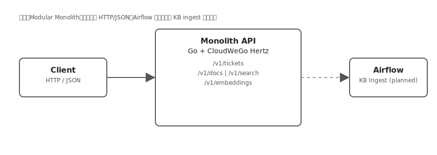

# C4 容器图（Container Diagram）

本图从容器视角描述当前“客服系统与 AI”平台的高层架构（不含代码细节）。

- 范围：单体应用（Modular Monolith）对外提供 HTTP/JSON 接口。
- 技术栈：Go 1.22 + CloudWeGo Hertz。
- 外部依赖：无持久化数据库；AI 向量与 KB 索引为进程内实现；Airflow 为 KB ingest 的外部编排，当前仅规划。

```mermaid
graph TD
    Client[Person: 客户端/调用方]
    Monolith[Container: Monolith API (Go + Hertz)\n路由: /v1/tickets, /v1/docs|/v1/search, /v1/embeddings]
    Airflow[Container: Airflow (KB Ingest Pipeline) | 规划中]

    Client -->|HTTP / JSON| Monolith
    Monolith -->|KB ingest (planned)| Airflow
```

说明与约束：
- 单容器运行：业务模块（Tickets、KB、AI）均在同一进程内，内存态数据结构承载工单仓库、KB 索引与 Mock Embeddings。
- 数据持久化：当前无数据库，重启即失；若演进为持久化，将在本文档新增“Database Container”。
- 运行时调用：Client → Monolith API（Hertz）；Airflow 与运行时暂不耦合，仅作为 KB ingest 的外部编排（未来可能通过批量接口或消息通道对接）。
- 非功能：水平扩展需引入共享存储/索引与一致性设计；可观测性（日志/指标/追踪）后续补充。

备用（ASCII）：

```
Client (HTTP/JSON) --> Monolith API (Go+Hertz) --> Airflow (KB Ingest, planned)
```

无需插件的静态图（SVG，VS Code 原生可预览）：



PlantUML 版本（推荐在 VS Code 安装 PlantUML 扩展预览）：`./c4-container.puml`
