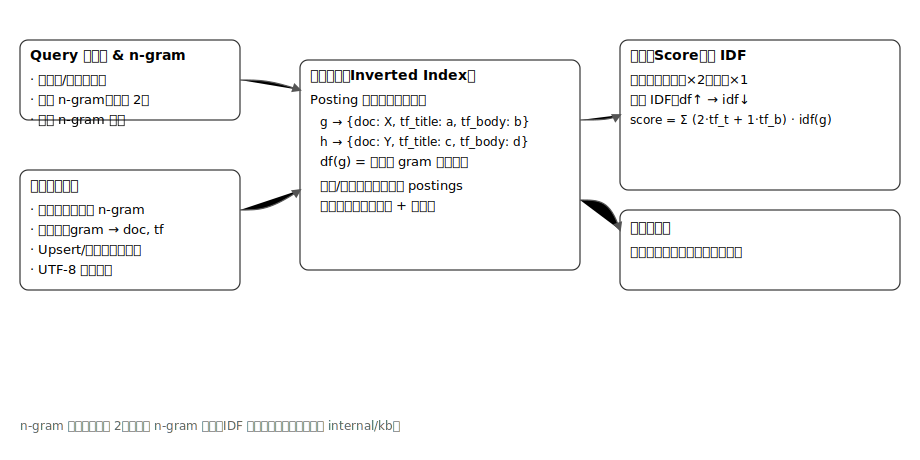

## KB 检索原理

本小节用一张简单示意图，说明 n-gram 分词、倒排索引与 IDF 加权之间的关系，以及本项目 KB 检索的打分思路。

核心流程（查询→候选→打分→排序）：

- 规范化与 n-gram：
  - 将查询和文档内容做基础规范化（大小写、空白、UTF-8 安全），再生成 n-gram（默认 n=2，可配置）。
  - 查询侧对 n-gram 去重，减少重复短语的放大效应。
- 倒排索引：
  - 为标题与正文分别维护 gram→doc postings（可计数作为 tf 的近似）。
  - 更新/删除文档时，按文档内的 gram 计数正确增减 postings，保证索引一致性。
- 候选召回：
  - 取查询 n-gram 在倒排表中的 posting 列表，做并集得到候选 doc 集。
- 打分与排序：
  - 对每个候选文档，按字段权重累加：标题权重 2、正文权重 1。
  - 每个 gram 的贡献 ≈ (tf_title×2 + tf_body×1) × idf(gram)。idf 使用简化形式（随文档频率 df 增大而递减），提升稀有短语区分度。
  - 若 n-gram 无匹配，使用“子串回退”进行最小可用召回。
  - 生成 UTF-8 安全的结果摘要。

简化公式（示意）：

$score(doc) = \sum_{g\in Q} (2\cdot tf_{title}(g,doc) + 1\cdot tf_{body}(g,doc))\cdot idf(g)$

其中 $Q$ 是去重后的查询 n-gram 集合，$idf(g)$ 随 $df(g)$ 增大而下降（简化 IDF 形态即可满足相对权重需求）。

实现要点（与代码一致）：

- n-gram 默认 2，可通过配置调整。
- 查询 n-gram 去重；IDF 简化实现；标题/正文赋予不同权重。
- UTF-8 安全文摘，避免多字节截断。
- Upsert 语义：PUT/POST 均可写入；删除时正确回收索引；并发安全（细粒度锁+不变式）。
